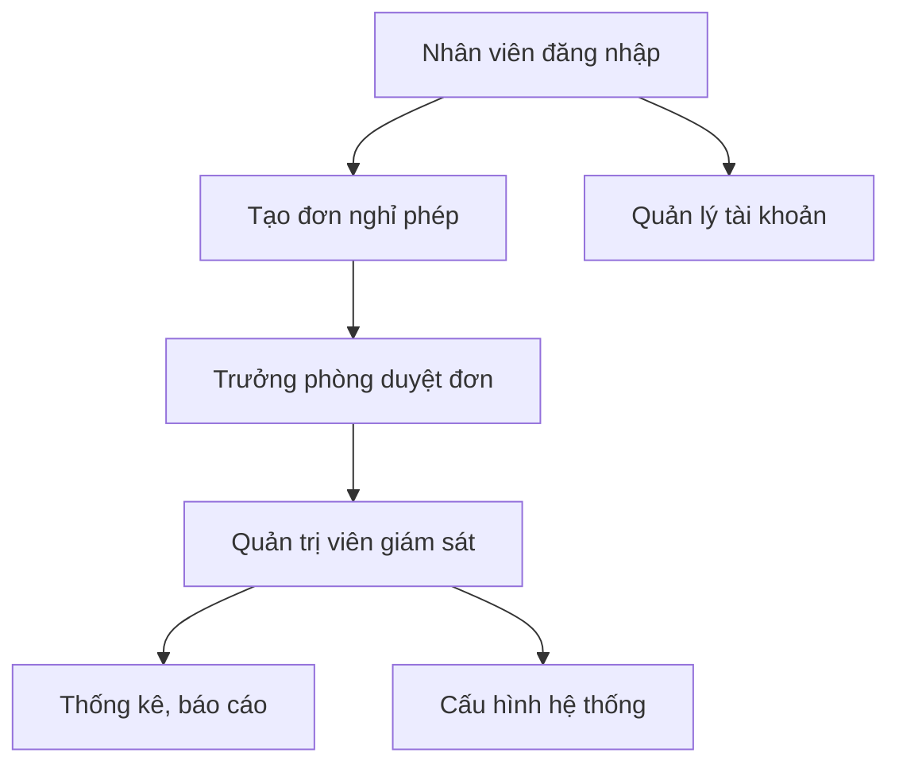

# JavaWeb Leave Management System

## Giới thiệu
Đây là hệ thống quản lý nghỉ phép cho doanh nghiệp, được xây dựng trên nền tảng Java Web. Hệ thống hỗ trợ quản lý nhân viên, phòng ban, phân quyền, đăng ký và duyệt nghỉ phép, cùng nhiều tính năng liên quan đến quản lý nhân sự.

## Tính năng chính
- Quản lý thông tin nhân viên
- Quản lý phòng ban
- Đăng ký nghỉ phép, duyệt nghỉ phép
- Phân quyền truy cập (Admin, Leader, Employee)
- Quản lý lịch sử nghỉ phép
- Báo cáo tổng hợp

## Công nghệ sử dụng
- Java Servlet/JSP
- Maven
- Tomcat
- JDBC
- MySQL (hoặc hệ quản trị CSDL tương thích)
- Jakarta EE
- Google API (tích hợp OAuth)

## Cấu trúc thư mục
- `src/main/java/asm/`: Mã nguồn chính
  - `controller/`: Xử lý request và điều hướng
  - `dao/`: Truy cập dữ liệu
  - `model/`: Định nghĩa các entity
  - `service/`: Xử lý nghiệp vụ
  - `util/`: Tiện ích chung
  - `filter/`: Lọc request (RBAC, xác thực)
  - `integrations/`: Tích hợp bên ngoài
- `src/main/resources/`: Cấu hình ứng dụng
- `src/main/webapp/`: Giao diện web (JSP, hình ảnh, cấu hình web)
- `test/`: Mã nguồn kiểm thử

## Hướng dẫn cài đặt
1. Cài đặt JDK 17 trở lên
2. Cài đặt Apache Tomcat 10+
3. Cài đặt MySQL và tạo database phù hợp
4. Cấu hình thông tin kết nối trong `src/main/resources/db.properties`
5. Build dự án bằng Maven:
   ```
   mvn clean package
   ```
6. Deploy file `asm-1.0.war` lên Tomcat
7. Truy cập hệ thống qua trình duyệt: `http://localhost:8080/asm-1.0`

## Tài khoản mẫu
- Admin: `admin/admin123`
- Leader: `leader/leader123`
- Employee: `employee/employee123`

## Đóng góp
Vui lòng fork repository, tạo pull request và mô tả rõ thay đổi. Đảm bảo tuân thủ chuẩn mã nguồn và kiểm thử trước khi gửi.

## Liên hệ
- Tác giả: duongvn9
- Email: duongvn9@example.com

## License
MIT License

### 2.8. Bảo mật & Phân quyền
- Kiểm soát truy cập các chức năng theo vai trò.
- Đảm bảo an toàn dữ liệu người dùng.

---

## 3. Các thành phần chính

### 3.1. Controller (Servlet)
- Xử lý request, điều hướng view, gọi service/dao.
- Ví dụ: LeaveRequestCreateServlet, AdminUserListServlet, SigninServlet, ...

### 3.2. Service
- Xử lý nghiệp vụ, logic phức tạp.
- Ví dụ: LeaveRequestService, UserService, LeaveAutoService.

### 3.3. DAO (Data Access Object)
- Truy xuất dữ liệu từ DB.
- Ví dụ: LeaveRequestDao, UserDao, ApprovalDao, QuotaDao.

### 3.4. Model
- Định nghĩa các entity: User, Role, Department, LeaveRequest, ...

### 3.5. View (JSP)
- Giao diện người dùng, hiển thị dữ liệu, nhận input.
- Được tổ chức theo module: admin/, leave/, department/, ...

### 3.6. Filter
- Lọc request, kiểm tra phân quyền (RbacFilter).

### 3.7. Tích hợp ngoài
- Google OAuth (GoogleOAuthRedirectServlet, GoogleOAuthCallbackServlet, OauthConfig.java).
- AI/Quyết định tự động (nếu có): GeminiClient.java, Decision.java.

---

## 4. Quy trình hoạt động tiêu biểu



---

## 5. Công nghệ sử dụng
- Java Servlet, JSP
- JDBC (DBCP)
- Google OAuth 2.0
- YAML, XML
- Maven

---

## 6. Hướng dẫn cài đặt & chạy

1. Clone source code về máy:
   ```bash
   git clone <repo-url>
   ```
2. Cấu hình database trong `src/main/resources/script.sql` và các file cấu hình liên quan.
3. Build project với Maven:
   ```bash
   mvn clean package
   ```
4. Triển khai file WAR lên server (Tomcat/Glassfish).
5. Truy cập hệ thống qua trình duyệt.

---

## 7. Đóng góp & phát triển
- Đóng góp qua pull request hoặc liên hệ quản trị viên dự án.
- Vui lòng tuân thủ quy tắc code và chuẩn hóa commit.

---
