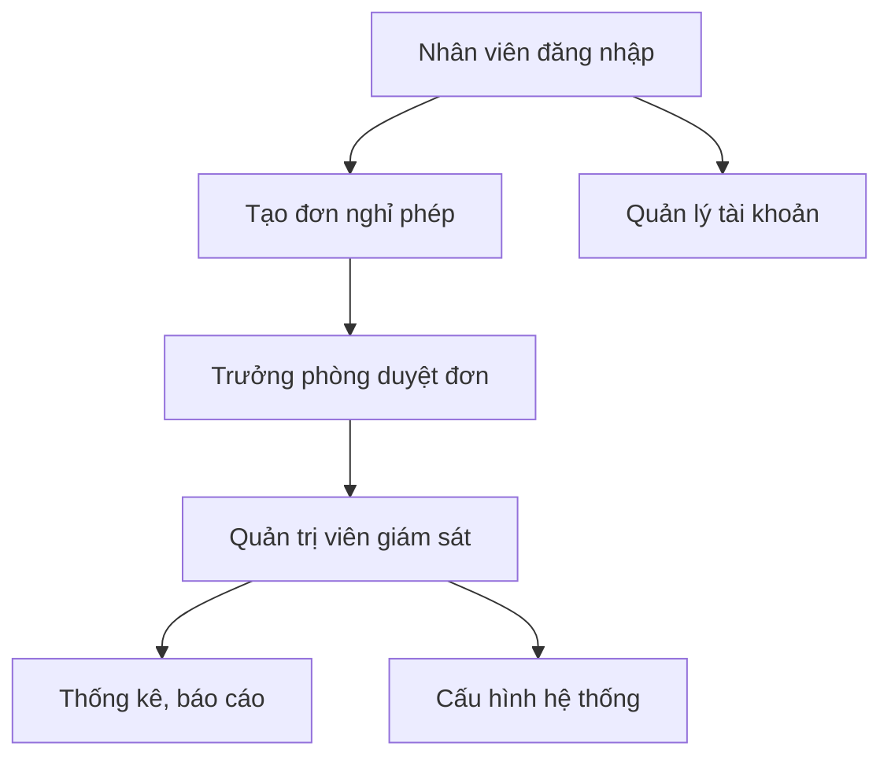

# Hệ Thống Quản Lý Nghỉ Phép

## 1. Giới thiệu

Hệ thống Quản lý Nghỉ phép là một ứng dụng web giúp doanh nghiệp quản lý quy trình xin nghỉ phép của nhân viên, bao gồm tạo đơn, duyệt đơn, thống kê, phân quyền và cấu hình hệ thống. Hệ thống hỗ trợ nhiều vai trò người dùng, tích hợp đăng nhập Google, và đảm bảo bảo mật dữ liệu.

---

## 2. Chức năng hệ thống

### 2.1. Đăng nhập & Xác thực
- Đăng nhập bằng tài khoản nội bộ hoặc Google OAuth.
- Phân quyền truy cập theo vai trò: Nhân viên, Trưởng phòng, Quản trị viên.
- Đăng xuất an toàn.

### 2.2. Quản lý đơn nghỉ phép
- Nhân viên tạo mới, chỉnh sửa, huỷ đơn nghỉ phép.
- Xem danh sách các đơn nghỉ phép của bản thân.
- Theo dõi trạng thái đơn: Đang chờ duyệt, Đã duyệt, Từ chối, Đã huỷ.

### 2.3. Duyệt đơn nghỉ phép
- Trưởng phòng xem và duyệt/từ chối các đơn nghỉ phép của nhân viên trong phòng ban.
- Quản trị viên có thể xem và can thiệp vào toàn bộ đơn nghỉ phép.

### 2.4. Quản lý người dùng
- Quản trị viên thêm, sửa, xoá tài khoản người dùng.
- Phân quyền và gán vai trò cho từng người dùng.
- Xem danh sách người dùng theo phòng ban.

### 2.5. Quản lý phòng ban
- Xem danh sách nhân viên theo từng phòng ban.
- Quản trị viên có thể cấu hình thông tin phòng ban.

### 2.6. Cấu hình hệ thống
- Quản trị viên cấu hình các thông số hệ thống: số ngày phép mặc định, quy tắc nghỉ phép, v.v.
- Cập nhật các quy tắc nghỉ phép từ file cấu hình.

### 2.7. Dashboard & Thống kê
- Hiển thị tổng quan số lượng đơn nghỉ phép, trạng thái đơn, thống kê theo phòng ban, cá nhân.
- Thống kê số ngày phép đã sử dụng, còn lại.

### 2.8. Bảo mật & Phân quyền
- Kiểm soát truy cập các chức năng theo vai trò.
- Đảm bảo an toàn dữ liệu người dùng.

---

## 3. Các thành phần chính

### 3.1. Controller (Servlet)
- Xử lý request, điều hướng view, gọi service/dao.
- Ví dụ: LeaveRequestCreateServlet, AdminUserListServlet, SigninServlet, ...

### 3.2. Service
- Xử lý nghiệp vụ, logic phức tạp.
- Ví dụ: LeaveRequestService, UserService, LeaveAutoService.

### 3.3. DAO (Data Access Object)
- Truy xuất dữ liệu từ DB.
- Ví dụ: LeaveRequestDao, UserDao, ApprovalDao, QuotaDao.

### 3.4. Model
- Định nghĩa các entity: User, Role, Department, LeaveRequest, ...

### 3.5. View (JSP)
- Giao diện người dùng, hiển thị dữ liệu, nhận input.
- Được tổ chức theo module: admin/, leave/, department/, ...

### 3.6. Filter
- Lọc request, kiểm tra phân quyền (RbacFilter).

### 3.7. Tích hợp ngoài
- Google OAuth (GoogleOAuthRedirectServlet, GoogleOAuthCallbackServlet, OauthConfig.java).
- AI/Quyết định tự động (nếu có): GeminiClient.java, Decision.java.

---

## 4. Quy trình hoạt động tiêu biểu



---

## 5. Công nghệ sử dụng
- Java Servlet, JSP
- JDBC (DBCP)
- Google OAuth 2.0
- YAML, XML
- Maven

---

## 6. Hướng dẫn cài đặt & chạy

1. Clone source code về máy:
   ```bash
   git clone <repo-url>
   ```
2. Cấu hình database trong `src/main/resources/script.sql` và các file cấu hình liên quan.
3. Build project với Maven:
   ```bash
   mvn clean package
   ```
4. Triển khai file WAR lên server (Tomcat/Glassfish).
5. Truy cập hệ thống qua trình duyệt.

---

## 7. Đóng góp & phát triển
- Đóng góp qua pull request hoặc liên hệ quản trị viên dự án.
- Vui lòng tuân thủ quy tắc code và chuẩn hóa commit.

---
